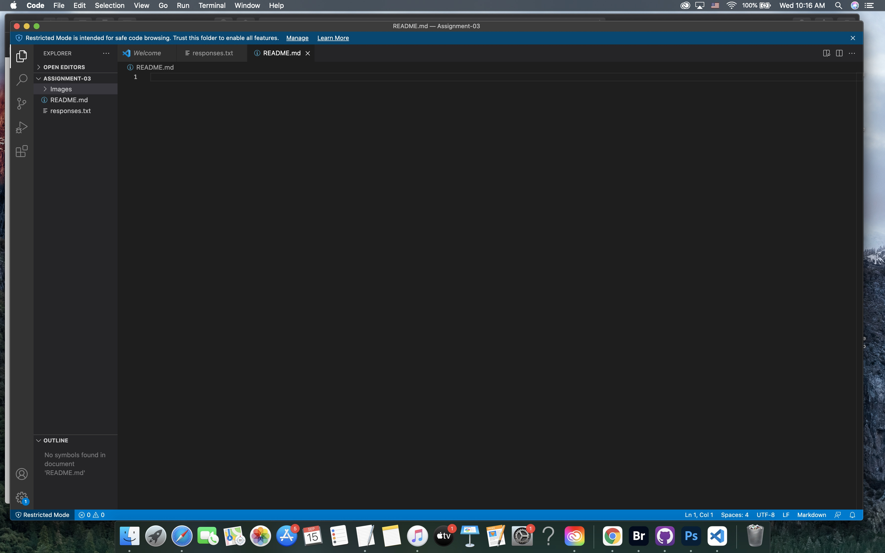

# Assignment 3
## Rebecca Gallegos

- I have learned in depth how the internet and world wide web work.
- I know how to structure my directory and files effectively.
- I have learned how to use some of the basic Markdown elements.

This is the most [frequented website](https://www.umt.edu/my/) I use for school.

[My Responses](./responses.txt)

