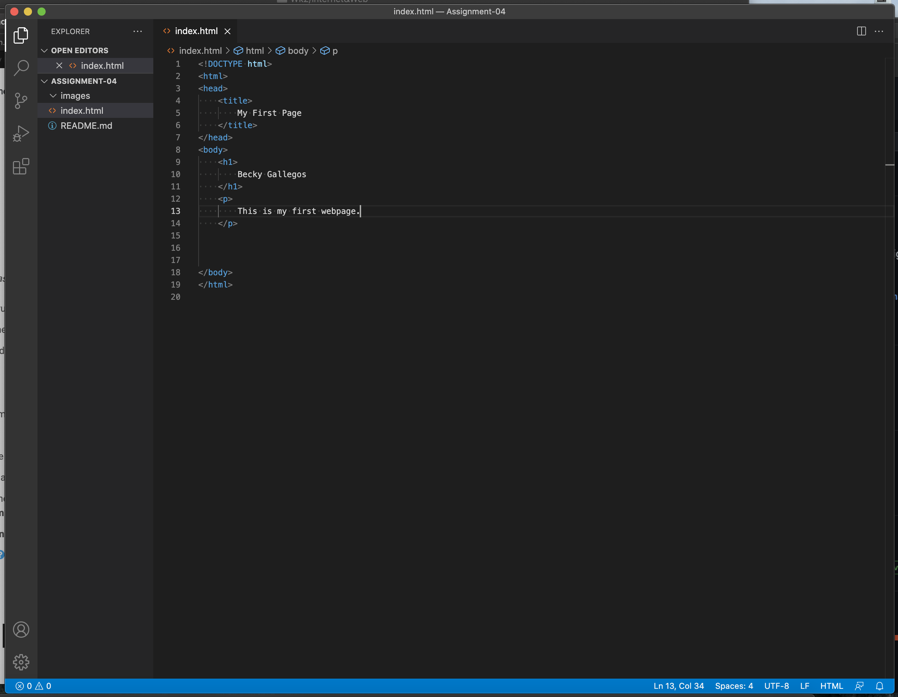

1)  The main browser I currently use is Safari. I have downloaded chrome to my computer but very seldom use it. 
Browsers are software programs that give access to the internet from a device. They translate and depict information such as text, images, video using markup languages that can be displayed on to the World Wide Web. 

2) A markup language is a system for documents that create structure and give insturctions for it's layout using tags and elements within those tags, that are then translated by browsers to display the document.  
One of the most standard markup languages is HTML for creating Web pages. It uses different tags and elements to define the structure of how web browsers should display the web page. 

