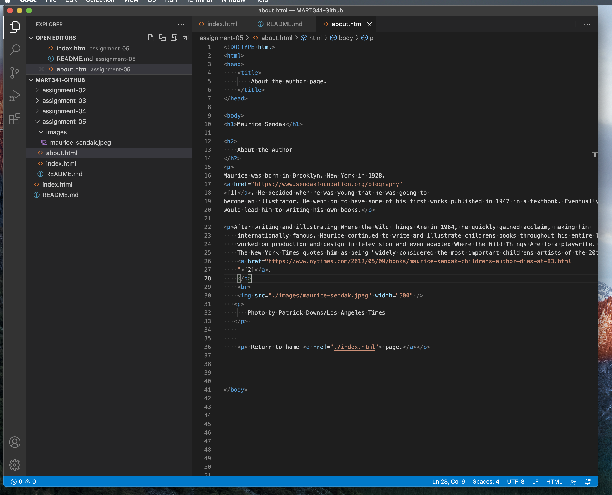

1) Where did you go? What did it look like? How has it changed?

When using the WayBack website I took it literally and went way back to Jan of 1999 to the National Geographic website. I guess my curiosity to remember what the web looked like in my childhood got the best of me because I did that for quite a few websites.

 It's interesting to see in 20+ years how advanced not only the stylization has come but also the amount of info available. The 1999 page was limited in graphics and you could see the basics of layout being used. The information was limited to a few articles and most of the links you clicked sent you to a single page of more information. Now the website flourishes with the latest stylization, it is very interactive, keeping the viewer entertained with scrolls and picture links and the amount of info comparatively is massive. 

2)Summarize your experience with these last few topics. What did you learn? What was difficult, easy, or still misunderstood?
 
I would say that the easiest part so far has been getting set up, which I have the creative coding class to thank for that, most of the set up and basics are familiar. Honestly I haven't ran into much difficulty yet. I do like that we've covered the structuring and naming of directories and files, I've used it not only for this class but with my other classes, I'm able to stay a bit more organized.  

